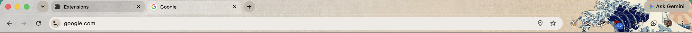
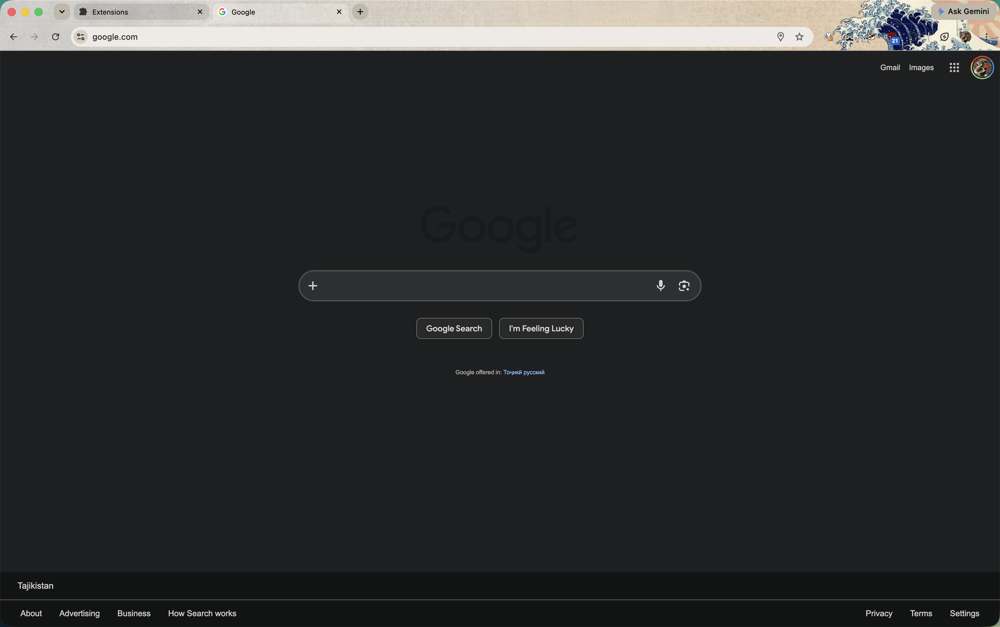

# Kanagawa Great Wave, for Chrome

Hokusai's Great Wave running across the tab strip and the toolbar, with the open
tab lifted out of it. This is a port of a Firefox theme to Chrome, which takes
more than copying the image across because the two browsers place frame artwork
by different rules.

## The Firefox original

**[Japan Style - Kanagawa Great Wave HI RES](https://addons.mozilla.org/en-US/firefox/addon/japan-style-kanagawa-gr-232767/)**
by **firefuze**, on addons.mozilla.org, licensed CC BY-SA 3.0. If you use
Firefox, install that instead: it is the same picture and it handles window
resizing better than Chrome can.

The full-resolution artwork it ships is kept here as
[`source/kanagawa-3000x200.jpg`](source/kanagawa-3000x200.jpg), 3000x200, exactly
as the add-on packages it. Everything in `images/` is generated from that file by
`make-images.py`, so the original is the only asset worth preserving.

## Install

Download `kanagawa-great-wave.crx` from the [latest release](../../releases/latest)
and drag it onto `chrome://extensions`. Chrome accepts a self-signed crx when the
extension is a theme, so Developer mode is not needed.

To load it unpacked instead, clone the repo and pick the folder in
`chrome://extensions` with Developer mode on. Leave the folder in place, since
Chrome re-reads it at every start.

## Fitting it to your screen

Firefox pins frame images to the right edge of the window. Chrome pins them to
the left and repeats them, and exposes no setting to change that, so the wave
only lands where Firefox puts it if the image is exactly as wide as the window.
The image here is cut for a full-screen window on a 1710 point display. For any
other screen, run `./make-images.py <width>` with that screen's width in points
and reload the theme. A window narrower than that width loses the wave off the
right side.

## Why there are two images

Chrome fills the active tab with the *toolbar* image rather than the frame image,
and aligns it to the tab instead of to the toolbar. The tab therefore shows rows
22 to 57 of that image while the toolbar shows everything from row 56 down.
`make-images.py` lightens only those upper rows, which lifts the open tab the way
Firefox does while leaving the wave in the toolbar at full strength.

Firefox also draws a dark outline around its active tab. Chrome only does that
for system themes, never for an extension theme, so the lift here is a little
stronger than Firefox's to carry the job alone. `ACTIVE_TAB_LIFT` in the script
sets it. `background_tab` in the manifest sets how far the other tabs sink so
their edges stay readable.

The 16 rows of padding at the top of both images exist because Chrome draws theme
images as if they begin 16 DIP above the tab strip, which is
`ThemeProperties::kFrameHeightAboveTabs` in its source.

## Licence

The code, meaning `make-images.py` and the manifest, is GPL-3.0. See
[`LICENSE`](LICENSE).

The artwork is a different matter. Hokusai's *Under the Wave off Kanagawa*, circa
1831, is public domain, but the cropped and composited version used here comes
from firefuze's add-on under
[CC BY-SA 3.0](https://creativecommons.org/licenses/by-sa/3.0/). ShareAlike means
the images stay on that licence and cannot be relicensed under the GPL, so
`source/` and `images/` remain CC BY-SA 3.0, attributed to firefuze. See
[`LICENSE-ARTWORK`](LICENSE-ARTWORK). Reuse them on those terms: credit firefuze,
link the original, share alike.
